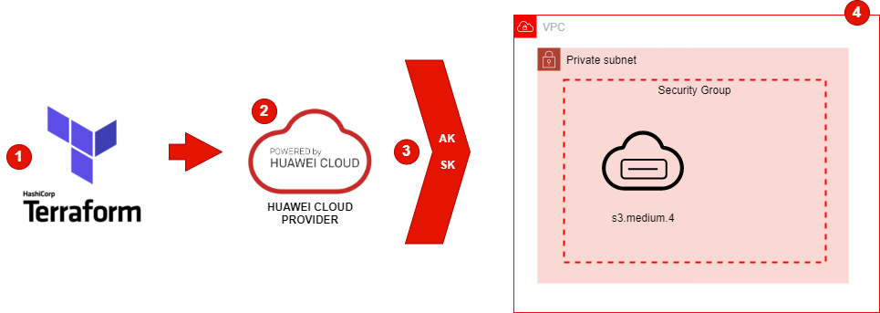

# Huawei Terraform Scripts
------------

El siguiente es un ejemplo de aprovisionmiento de infraestructura en la nube de Huawei Cloud usando funcionalidades de Iac (Infrastructure as Code) con la herramienta Terraform.

Principalmente se trata del aprovisionamiento de:
* Componentes de Networking: [VPC](https://www.huaweicloud.com/intl/es-us/product/vpc.html), Subnet, Security Group
* Instancia de cómputo ECS ([Elastic Cloud Server](https://www.huaweicloud.com/intl/es-us/product/ecs.html))

## Requirements
------------
* Terraform: https://www.terraform.io
* Huawei provider: https://github.com/huaweicloud/terraform-provider-huaweicloud
